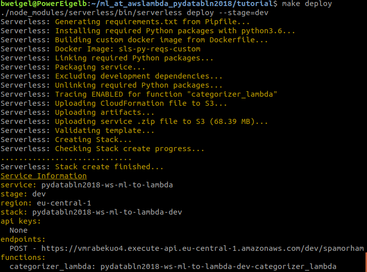

# Deploying ML-models to AWS lambda - Workshop @ PyData Berlin 2018 (WIP)

See https://bweigel.github.io/pydata_bln_2018/#/ for slides & [Dockerhub](https://hub.docker.com/r/bweigel/ml_at_awslambda_pydatabln2018_autobuild/) for Docker images.

### PyData Attendees:

**`<start importantInfo>`**

Since I am not sure how well the internet will work on the Charité premises I urge you to:
- install [Docker](https://www.docker.com/community-edition)
- download the docker image we will be working with (this should contain everything you need to work along):
    - `docker pull bweigel/ml_at_awslambda_pydatabln2018_autobuild`
- do items **1** and **2** in the **[Quickstart](https://github.com/bweigel/ml_at_awslambda_pydatabln2018#quickstart)**

**`<end importantInfo>`**

### Intro

In this Workshop you will be using the [Serverless] Framework to deploy a pre-trained model (Naive Bayes Classifier) 
based on the [SMS Spam Collection dataset](https://www.kaggle.com/uciml/sms-spam-collection-dataset/version/1) to the cloud.
The training was carried out like it is described [here](https://www.kaggle.com/mzsrtgzr2/naive-bayes-classifier-spam-ham).
The code is located here: [`tutorial/training/train.py`](tutorial/training/train.py)

Your cloud-service will use AWS Lambda and Api-Gateway behind the scenes.
AWS Api-Gateway will provide a API endpoint where texts can be classified using the `POST` method with the text as payload.
The payloads will be forwarded to a AWS lambda function that knows the model and does the actual classification. 


### Quickstart

1. create an AWS account at [https://aws.amazon.com](https://aws.amazon.com) if you have not already done so (see [Instruction](https://aws.amazon.com/premiumsupport/knowledge-center/create-and-activate-aws-account/))
    - you will need a credit card to do this, but you __will not be charged__ if you stay in the [free tier](https://aws.amazon.com/free/)
    - **BEWARE** the S3 & ApiGateway capabilities, that we will be using, will only be free of charge for the first 12 months!
    - [create a new user within IAM](https://docs.aws.amazon.com/IAM/latest/UserGuide/id_users_create.html) (do not use root user to do stuff in your account and be sure to use MFA and a secure password)
    - [create an access key](https://docs.aws.amazon.com/IAM/latest/UserGuide/id_credentials_access-keys.html#Using_CreateAccessKey) for programmatic access
2. install and setup the [AWS Command Line Interface](https://aws.amazon.com/cli/)
    - `pip install awscli`
    - `aws configure` (see [here](https://docs.aws.amazon.com/cli/latest/userguide/cli-chap-getting-started.html))
3. clone repo `git clone https://github.com/bweigel/ml_at_awslambda_pydatabln2018.git` 
    - and change into the `tutorial` folder `cd ml_at_awslambda_pydatabln2018/tutorial`
4. start docker container: `cd tutorial` and `./start_docker.sh`
5. work along merrily ... or,    


----------------------------------------------------------------------------------------------------

## Try out the demo project

### Steps (using the provided docker image)

**1.-4.** of [Quickstart](https://github.com/bweigel/ml_at_awslambda_pydatabln2018#quickstart), then...

Inside the container:
```
$ cd /demo
$ make deploy-model
    # ... enter your S3-info when prompted
$ vi serverless.yml
    # ... see & edit TODOs in serverless.yml
$ make setup && make deploy
    # ... serverless is deploying ...
$ curl -X POST https://<see serverless output>.execute-api.eu-central-1.amazonaws.com/dev/spamorham -d "Am I spam or ham?"
```
### Steps (using your machine)
 
**1.-3.** of [Quickstart](https://github.com/bweigel/ml_at_awslambda_pydatabln2018#quickstart), then...
4. setup tooling with `make setup`. This installs:
    - virtualenv with dependencies defined in `Pipfile` using `pipenv` in `.venv`
    - the serverless framework and dependencies defined in `package.json` via `npm install` in `node_modules`    
5. create an s3 bucket to hold models and lambda code: `make bucket`
    - **BEWARE** S3-bucket names must be globally unique!
6. upload the provided models in `training/models` using `make deploy-model`
    - this will prompt you to enter the bucket name from **5** and an object prefix (think of it as a folder name)
    - the output tells you what has been uploaded:
        ```bash
        $ make deploy-model
        ./training/deploy_model.sh
        Enter bucket name: eigelbdemo
        Enter object prefix: pydatabln2018
        + aws s3 cp --recursive ./training/models s3://eigelbdemo/pydatabln2018/
        upload: training/models/naive_bayes_clf.pkl to s3://eigelbdemo/pydatabln2018/naive_bayes_clf.pkl
        upload: training/models/tfidf_vectorizer.pkl to s3://eigelbdemo/pydatabln2018/tfidf_vectorizer.pkl
        ```
5. find the `TODOs` in the `serverless.yml` and fill in the bucket specified in **5** and the path to the classifiers:
    
    
6. deploy your service to AWS using `make deploy`
    
7. test your service (take url from `make deploy` output):
     ```
     $ curl -X POST https://vmrabekuo4.execute-api.eu-central-1.amazonaws.com/dev/spamorham -w "\n" -d "Am I spam or am I ham?" 
    ["spam"]
    ```

-------------------------------------------------------------------------------

## Things to keep in mind

All the ML frameworks in Python are quite heavy weight when it comes to size. However for individual lambda deployments 
(not as part of a cloudformation stack) there is a hard filesize limit of 50 MB enforced by AWS. This is not only because AWS 
wants to screw with you, but because it wants developers to build apps with the highest performance.
There are a couple of tricks to reduce the size of your deployment zip-file. See [here](https://tech.europace.de/slimifying-aws-lambdas/) and the [resources section](https://github.com/bweigel/ml_at_awslambda_pydatabln2018#resources) for more info.

## FAQ

**Why use the serverless framework (and not something like the AWS Serverless Application Model, SAM)?**
The serverless framework is the most mature tooling around for deploying serverless services. It is actively developed, 
has a big community and a rich ecosystem of plugins, which help with keeping our dependencies slim (see https://tech.europace.de/slimifying-aws-lambdas/) among other things.


## Troubleshooting

1. `make test*` fails with `FileNotFoundError`:
    ```bash
    $ make test-all
    set -eux pipefail
    if [ ! -d ".venv" ]; then \
            export PIPENV_IGNORE_VIRTUALENVS=1, PIPENV_VENV_IN_PROJECT=1 && pipenv lock && pipenv sync --dev; \
    fi
    pipenv run tox
    Traceback (most recent call last):
      File "/var/lang/bin/pipenv", line 11, in <module>
        sys.exit(cli())
      File "/var/lang/lib/python3.6/site-packages/pipenv/vendor/click/core.py", line 722, in __call__
        return self.main(*args, **kwargs)
      File "/var/lang/lib/python3.6/site-packages/pipenv/vendor/click/core.py", line 697, in main
        rv = self.invoke(ctx)
      File "/var/lang/lib/python3.6/site-packages/pipenv/vendor/click/core.py", line 1066, in invoke
        return _process_result(sub_ctx.command.invoke(sub_ctx))
      File "/var/lang/lib/python3.6/site-packages/pipenv/vendor/click/core.py", line 895, in invoke
        return ctx.invoke(self.callback, **ctx.params)
      File "/var/lang/lib/python3.6/site-packages/pipenv/vendor/click/core.py", line 535, in invoke
        return callback(*args, **kwargs)
      File "/var/lang/lib/python3.6/site-packages/pipenv/cli.py", line 637, in run
        do_run(command=command, args=args, three=three, python=python)
      File "/var/lang/lib/python3.6/site-packages/pipenv/core.py", line 2305, in do_run
        do_run_posix(script, command=command)
      File "/var/lang/lib/python3.6/site-packages/pipenv/core.py", line 2285, in do_run_posix
        os.execl(command_path, command_path, *script.args)
      File "/var/lang/lib/python3.6/os.py", line 527, in execl
        execv(file, args)
    FileNotFoundError: [Errno 2] No such file or directory
    ```
    - **Solution**: `make clean && make setup` then run `make test-all`
2. Error when running `serverless deploy`: 
    ```bash
    Serverless: Building custom docker image from Dockerfile...
    
    Error --------------------------------------------------
    
    Cannot connect to the Docker daemon at unix:///var/run/docker.sock. Is the docker daemon running?
    ...

    ```
    - **Solution**: You are running serverless deploy inside a docker container and the serverless-requirements-plugin
    tries to spawn another nested container to package dependecies.
    Run deploy outside a docker container, or set `custom.pythonRequirements.dockerizePip` to `false` in the `serverless.yml`.    

## Resources

- [AWS Lambda Python magic. Tips for creating powerful Lambda functions.][1] 

[1]: https://blog.mapbox.com/aws-lambda-python-magic-e0f6a407ffc6
[Serverless]: https://serverless.com/framework/